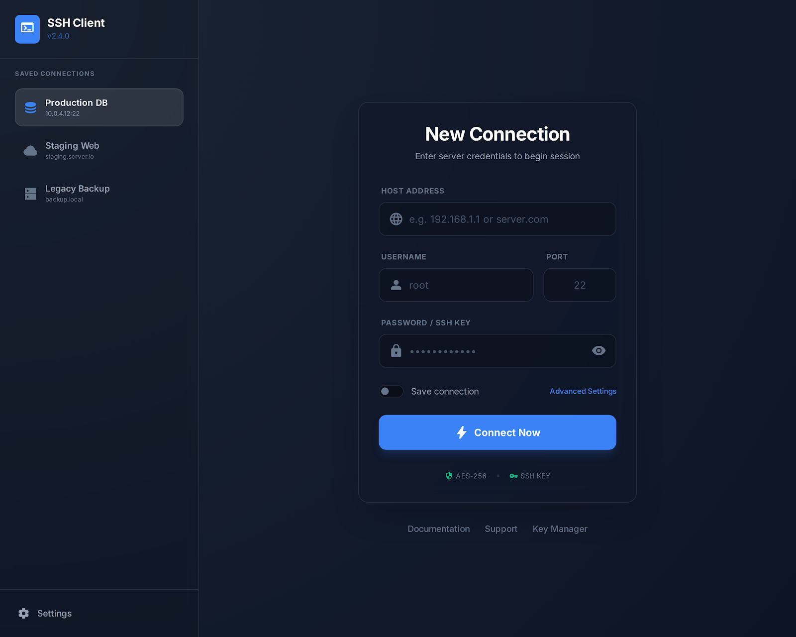
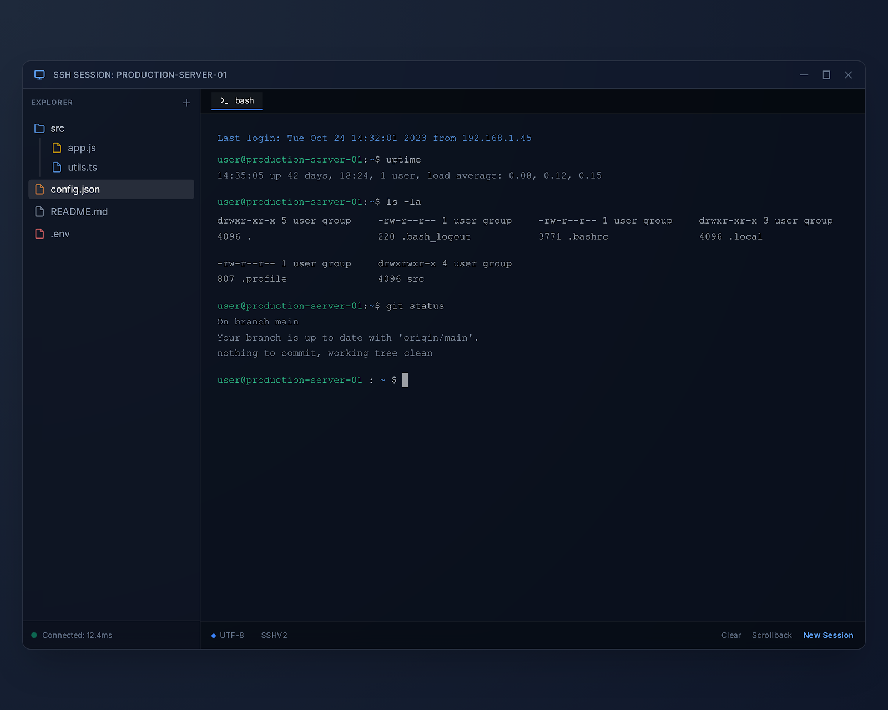

# RustSSH Client

RustSSH Client is a native desktop SSH and SFTP client built with Rust and Iced. It combines terminal access, remote file browsing, encrypted saved connections, and a lightweight remote text editor in a single dark-themed desktop app.

## Screenshots

| Login | Workspace |
| --- | --- |
|  |  |

## Features

- Password and PEM key authentication.
- Saved hosts stored in an encrypted local vault.
- Configurable credential retention policies: 1 hour, 1 day, 1 week, 30 days, or forever.
- Keyring-backed storage with a stable local fallback when the keyring backend is unavailable.
- Interactive terminal session with ANSI color rendering and clipboard support.
- Remote SFTP explorer with upload, download, rename, copy, move, and delete actions.
- Right-click file actions and transfer progress tracking.
- Remote UTF-8 text editor with syntax highlighting and save-back support.
- Session-aware directory refresh when `cd` commands are entered in the terminal.
- Structured logging via `tracing`.
- Unit and integration test coverage for storage, SSH session handling, path parsing, editor flows, and explorer actions.

## Current Status

The app is usable as a desktop client and includes the main SSH, SFTP, and remote editing flows. One visible placeholder remains: the `Key Manager` action is present in the UI, but the dedicated manager screen is not implemented yet.

## Tech Stack

- Rust 2024
- Iced 0.14
- ssh2 / libssh2 with vendored OpenSSL
- AES-GCM for encrypted local storage
- Serde for persistence
- Tracing for diagnostics

## Quick Start

### Windows

1. Install Rust with `rustup`.
2. Install Visual Studio Build Tools with the C++ workload.
3. Make sure `link.exe` is available on `PATH`.
4. If OpenSSL or `libssh2-sys` fails to build, install Strawberry Perl and ensure Perl is on `PATH`.
5. Run:

```powershell
cargo run
```

### Linux

Install Rust plus the usual native dependencies for Iced and OpenSSL. On Debian-based systems:

```bash
sudo apt install build-essential pkg-config libx11-dev libxkbcommon-dev libwayland-dev libssl-dev
cargo run
```

### macOS

```bash
brew install openssl pkg-config
cargo run
```

## Build

Debug build:

```bash
cargo build
```

Release build:

```bash
cargo build --release
```

The app starts with a default window size of `1200x780` and runs as a desktop GUI application.

## Testing

Run the standard test suite:

```bash
cargo test
```

Ignored SSH environment tests can be enabled when you have a reachable target server:

```bash
cargo test -- --ignored
```

Supported environment variables for the ignored SSH tests:

- `TEST_SSH_HOST`
- `TEST_SSH_PORT`
- `TEST_SSH_USERNAME`
- `TEST_SSH_PASSWORD`
- `TEST_SSH_WRITE_DIR`

## Security Notes

- Passwords and imported PEM keys are stored only in encrypted local vault files.
- The encryption key is loaded from the OS keyring when available.
- If the keyring backend is unavailable, the app falls back to a stable local master-key file instead of regenerating keys unexpectedly.
- Saved credentials can expire automatically based on the selected retention window.
- Sensitive fields are redacted from debug output.

## Repository Layout

```text
src/
  app/
    messages.rs
    state.rs
    update.rs
    view.rs
  models/
    editor.rs
    file_entry.rs
    host.rs
    key.rs
    transfer.rs
  sftp/
    client.rs
    file_tree.rs
    transfers.rs
  ssh/
    client.rs
    session.rs
    terminal.rs
  storage/
    credentials.rs
    crypto.rs
    keys.rs
  ui/
    editor.rs
    file_tree.rs
    host_list.rs
    login.rs
    styles.rs
    terminal.rs
tests/
  ssh_env.rs
  storage_roundtrip.rs
```

## Architecture Notes

- `app/` owns application state, messages, subscriptions, and update logic.
- `ssh/session.rs` runs the background SSH worker and emits session events back to the UI.
- `sftp/` handles directory enumeration, remote file operations, and transfer bookkeeping.
- `storage/` manages encrypted persistence for saved hosts and imported keys.
- `ui/` contains the Iced view layer and styling.

## Troubleshooting

### Windows build fails in OpenSSL or libssh2

Make sure Strawberry Perl is installed and on `PATH`. This is commonly required when building vendored OpenSSL dependencies on Windows.

### SSH handshake fails against modern OpenSSH servers

This repository intentionally enables `openssl-on-win32` for `ssh2` on Windows so libssh2 can use newer crypto support. If you remove that feature, key exchange and host-key negotiation can regress.

### Explorer navigation errors disconnect the session

That behavior is not expected in the current codebase. Directory refresh and navigation failures are handled as session events rather than fatal worker crashes.

## Contributing

Issues and pull requests are welcome. If you open a PR, keep changes focused and run `cargo test` before submitting.

## Project Link

Repository: <https://github.com/jaggerjack61/RustSSHClient>

## License

No license file has been added to this repository yet.