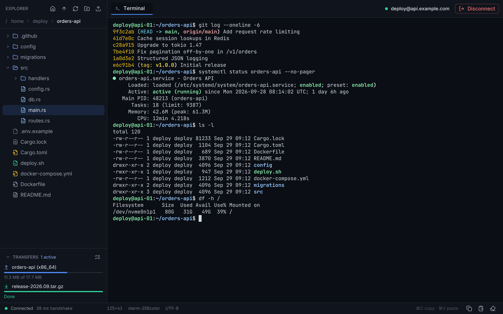
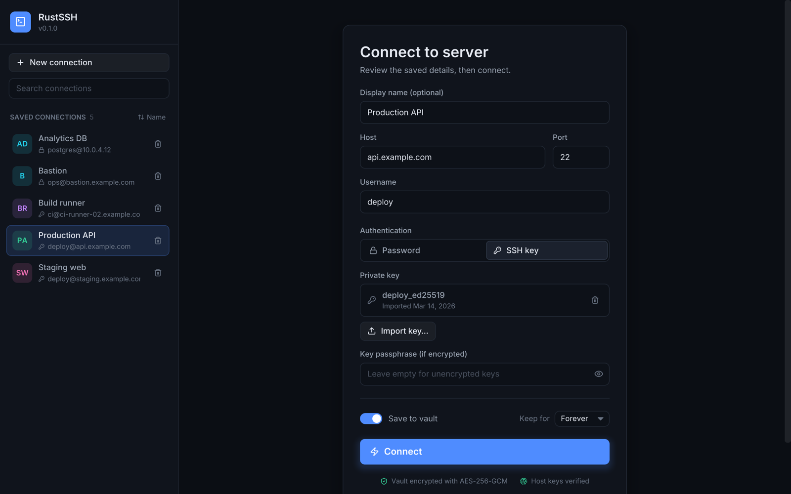
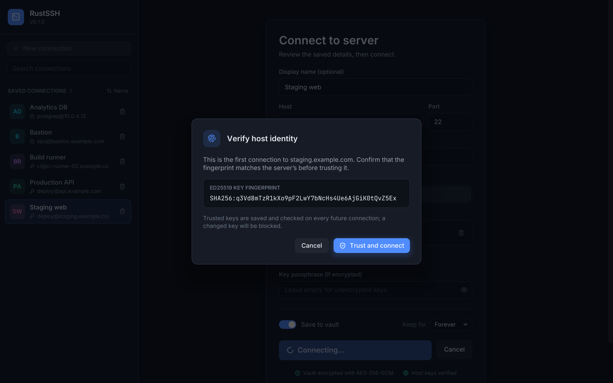
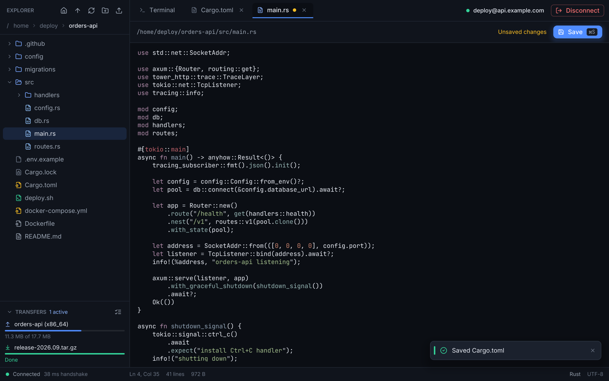
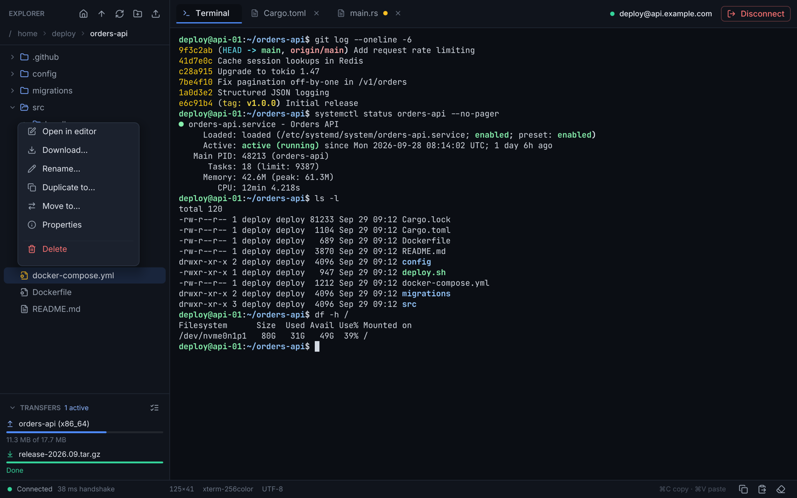

<div align="center">


# RustSSH

**A fast, native SSH client with a built-in file explorer and editor.**

Connect, browse, transfer and edit on remote servers from one window, on Windows, macOS and Linux.


<br>



</div>

<br>

## Why RustSSH

Most SSH workflows bounce between a terminal, an SFTP client and an editor. RustSSH puts them side by side in a single lightweight native app with no Electron and no web view, and it is built around safe defaults: every server is verified, every credential is encrypted, and every destructive action asks first.

## Highlights

| | |
| --- | --- |
| **A real terminal** | 256-color and true-color output, scrollback, correct keys for vim, less and htop, safe multi-line paste, and a PTY that always matches the window. |
| **File explorer** | Browse with breadcrumbs, expand folders in place, follow symlinks, and it stays in sync when you `cd` in the terminal. |
| **Transfers** | Drag and drop to upload, download files or whole folders, and watch progress in a queue that runs up to four transfers at once. |
| **Remote editor** | Open any text file with syntax highlighting for common languages, preview Markdown, and save straight back to the server. |
| **Saved connections** | Search, sort and double-click to connect. Credentials live in an AES-256-GCM encrypted vault and can expire automatically. |
| **Verified hosts** | First-time servers show their key fingerprint for you to confirm. Trusted keys are pinned, and a changed key is blocked. |
| **Flexible sign-in** | Password (including keyboard-interactive servers) or OpenSSH/PEM private keys, with passphrase support. |
| **Consistent everywhere** | Bundled fonts and icons mean it looks and measures the same on every platform. |

## Screenshots

<table>
  <tr>
    <td width="50%"></td>
    <td width="50%"></td>
  </tr>
  <tr>
    <td align="center"><sub><b>Saved connections</b>: search, key or password auth, retention policy</sub></td>
    <td align="center"><sub><b>Host verification</b>: confirm the fingerprint on first connect</sub></td>
  </tr>
  <tr>
    <td width="50%"></td>
    <td width="50%"></td>
  </tr>
  <tr>
    <td align="center"><sub><b>Remote editor</b>: highlighting, unsaved-change tracking, one-key save</sub></td>
    <td align="center"><sub><b>File actions</b>: open, download, rename, duplicate, move, delete</sub></td>
  </tr>
</table>

## Getting Started

RustSSH is built from source. You need a recent stable [Rust toolchain](https://rustup.rs) (Rust 1.88 or newer). OpenSSL and libssh2 are compiled into the binary, so users don't need to install them separately.

<details open>
<summary><b>macOS</b></summary>

```bash
xcode-select --install        # if you don't have the command line tools yet
cargo run --release
```

</details>

<details>
<summary><b>Windows</b></summary>

1. Install [Visual Studio Build Tools](https://visualstudio.microsoft.com/visual-cpp-build-tools/) with the **Desktop development with C++** workload.
2. Install [Strawberry Perl](https://strawberryperl.com/), which the bundled OpenSSL build needs, and make sure `perl` is on your `PATH`.
3. Run:

```powershell
cargo run --release
```

</details>

<details>
<summary><b>Linux</b></summary>

Debian and Ubuntu:

```bash
sudo apt install build-essential pkg-config perl libx11-dev libxkbcommon-dev libwayland-dev
cargo run --release
```

Fedora:

```bash
sudo dnf install gcc make pkgconf-pkg-config perl libX11-devel libxkbcommon-devel wayland-devel
cargo run --release
```

</details>

The optimized binary is written to `target/release/rust_ssh_client` (`.exe` on Windows).

## Using RustSSH

### Connect to a server

1. Enter the host, port and username. A display name is optional.
2. Choose **Password** or **SSH key**. For keys, click **Import key…** and pick your private key (for example `~/.ssh/id_ed25519`). Enter a passphrase if the key is encrypted.
3. Leave **Save to vault** on to keep the connection, and choose how long to keep the credentials.
4. Click **Connect** or press `Enter`.

The first time you connect to a server, RustSSH shows its host key fingerprint. Compare it with the server's (for example `ssh-keygen -lf /etc/ssh/ssh_host_ed25519_key.pub` on the server), then choose **Trust and connect**.

Saved connections appear in the sidebar. Click one to fill in the form, or double-click to connect straight away.

### Work with files

- **Double-click** a folder to open it, or a file to edit it. A single click expands a folder in place.
- **Right-click** any entry for download, rename, duplicate, move, properties and delete.
- **Drag files** from your desktop onto the window to upload them to the current (or selected) folder.
- Use the toolbar above the tree to go home, go up, refresh, create a folder or upload.

### Keyboard shortcuts

| Action | macOS | Windows / Linux |
| --- | --- | --- |
| Save the open file | `⌘S` | `Ctrl+S` |
| Copy the terminal screen | `⌘C` | `Ctrl+Shift+C` |
| Paste into the terminal | `⌘V` | `Ctrl+Shift+V` or `Shift+Insert` |
| Scroll back through output | Mouse wheel / trackpad | Mouse wheel / touchpad |
| Move between form fields | `Tab` / `Shift+Tab` | `Tab` / `Shift+Tab` |
| Close a dialog or menu, cancel connecting | `Esc` | `Esc` |

Every other key, including `Ctrl+C`, `Ctrl+D` and `Ctrl+S`, goes to the remote shell.

## Security

- **Encrypted vault.** Saved passwords and private keys are stored only in an AES-256-GCM encrypted vault. The vault key is kept in the operating system keyring when one is available.
- **Private files.** The vault and its key are written atomically, so a crash can't corrupt them. On macOS and Linux they are readable only by your user account.
- **Host key pinning.** Every connection is checked against RustSSH's own `known_hosts` file, including the separate connections used for background transfers. A changed key stops the connection with a clear warning.
- **Expiring credentials.** Choose to keep a saved login for 1 hour, 1 day, 1 week, 30 days or forever; expired entries are removed automatically.
- **No secrets in logs.** Passwords and key material are redacted from debug output.

## Data & Configuration

RustSSH stores its vault, `known_hosts` and a small activity log in your platform's app data folder:

| Platform | Location |
| --- | --- |
| macOS | `~/Library/Application Support/com.RustSSH.RustSSHClient` |
| Windows | `%LOCALAPPDATA%\RustSSH\RustSSHClient\data` |
| Linux | `~/.local/share/rustsshclient` (or `$XDG_DATA_HOME/rustsshclient`) |

Set `RUSTSSH_DATA_DIR` to use a different folder, for example to run a portable copy from a USB drive:

```bash
RUSTSSH_DATA_DIR=/path/to/folder rust_ssh_client
```

## Troubleshooting

<details>
<summary><b>"Host key verification failed"</b></summary>

The server presented a different key than the one you trusted before. This is expected after a server is reinstalled or its keys are rotated, and it is also what a man-in-the-middle attack looks like. Once you have confirmed the change is legitimate, delete the server's line from the `known_hosts` file in the data folder above and connect again.

</details>

<details>
<summary><b>"Authentication failed"</b></summary>

- Check the username. Many cloud images use `ubuntu`, `ec2-user` or `admin` rather than `root`.
- For key authentication, make sure the matching public key is in `~/.ssh/authorized_keys` on the server, and enter the passphrase if the key has one.
- PuTTY `.ppk` keys aren't supported. Convert them with `puttygen key.ppk -O private-openssh -o key`.

</details>

<details>
<summary><b>The Windows build fails in OpenSSL or libssh2</b></summary>

Install Strawberry Perl and make sure it appears on your `PATH` before any other Perl. The bundled OpenSSL build needs it.

</details>

<details>
<summary><b>Handshake fails against a modern OpenSSH server on Windows</b></summary>

RustSSH enables the `openssl-on-win32` feature of `ssh2` so libssh2 supports current key exchange and host key algorithms. Keep that feature enabled if you customize `Cargo.toml`.

</details>

## Development

```bash
cargo test                      # unit and integration tests
cargo clippy --all-targets      # lints
cargo fmt                       # formatting
```

The tests in `tests/ssh_env.rs` exercise the real session worker against a live server: host key trust, shell I/O under heavy output, SFTP listing, editor save and read-back, and transfers. They are ignored by default. To run them:

```bash
TEST_SSH_HOST=127.0.0.1 TEST_SSH_PORT=22 TEST_SSH_USERNAME=me \
TEST_SSH_KEY_FILE=~/.ssh/id_ed25519 TEST_SSH_WRITE_DIR=/tmp/rustssh-tests \
cargo test --test ssh_env -- --ignored
```

Use `TEST_SSH_PASSWORD` instead of `TEST_SSH_KEY_FILE` for password authentication. `TEST_SSH_WRITE_DIR` must be a writable directory on the server.

The screenshots in this README are generated from demo data by a reproducible tool that drives the real UI:

```bash
cargo run --release --example screenshots -- docs/screenshots
```

### Architecture

```text
src/
  app/        Application state, messages, update logic and subscriptions
  ssh/        Connection and authentication, the session worker, terminal emulation
  sftp/       Directory listing, file operations and transfer bookkeeping
  storage/    Encrypted vault and master-key management
  models/     Hosts, keys, files, transfers and editor documents
  ui/         Views, plus the shared theme (design tokens) and components
assets/fonts/ Bundled Inter and JetBrains Mono
examples/     Screenshot generator
tests/        Integration tests
```

- Each session runs on its own worker thread. Terminal output and file events are streamed to the UI through an iced subscription instead of being polled, so an idle window stays idle.
- Transfers open their own connections, so large uploads and downloads never block the terminal.
- The terminal is emulated with [`vt100`](https://crates.io/crates/vt100), and its render is cached so it only redraws when the screen changes.

## Roadmap

- Mouse text selection in the terminal
- Multiple simultaneous sessions in tabs
- SSH agent and jump host (ProxyJump) support
- Port forwarding
- Prebuilt installers for each platform

## Contributing

Issues and pull requests are welcome at [github.com/jaggerjack61/RustSSHClient](https://github.com/jaggerjack61/RustSSHClient). Please keep changes focused, and run `cargo fmt`, `cargo clippy --all-targets` and `cargo test` before opening a pull request.

## License

A license for RustSSH has not been chosen yet. Until one is added, all rights are reserved by the author.

Bundled fonts: [Inter](https://rsms.me/inter/) and [JetBrains Mono](https://www.jetbrains.com/lp/mono/), both under the SIL Open Font License 1.1 (see `assets/fonts/`). Icons: [Lucide](https://lucide.dev) (ISC), via the `iced_fonts` crate.
